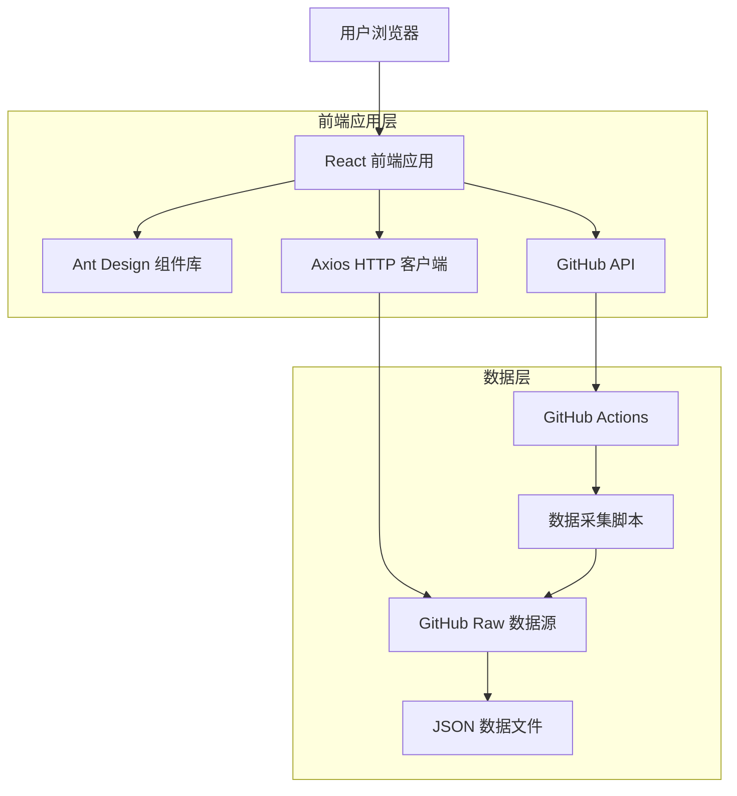
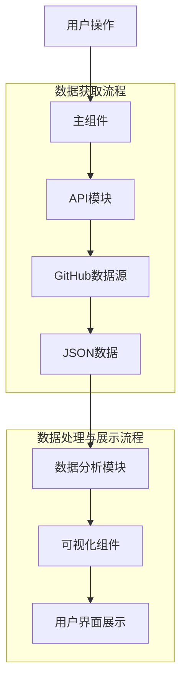
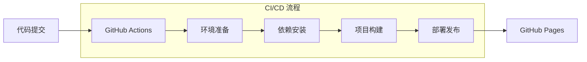

# 热榜数据查询平台

## 项目简介

热榜数据查询平台是一个基于 React 的单页应用，用于展示和分析抖音、百度等平台的热门榜单数据。该平台提供数据查询、趋势分析、关键词提取等功能，帮助用户了解热点话题的分布和变化趋势。

## 技术架构

### 整体架构图



### 技术栈

- **React 18.2.0**: 用于构建用户界面的 JavaScript 库
- **Vite 7.1.7**: 现代前端构建工具，提供快速的开发服务器和构建功能
- **Ant Design 5.12.5**: 企业级 UI 设计语言和组件库
- **@ant-design/plots 1.2.3**: Ant Design 的图表组件库，用于数据可视化
- **Axios 1.6.2**: HTTP 客户端，用于 API 请求
- **Day.js 1.11.10**: 轻量级日期处理库
- **Simple-statistics 7.8.8**: 简单统计功能库
- **@octokit/core**: GitHub API 客户端

### 目录结构

```
src/
├── App.jsx                 # 应用根组件
├── main.jsx               # 应用入口文件
├── styles/                # 全局样式
│   └── global.css
└── DouyinHotList/         # 核心功能模块
    ├── index.jsx          # 主组件
    ├── api.js             # API 请求模块
    ├── utils.js           # 工具函数
    ├── components/        # UI 组件
    │   ├── ControlPanel.jsx     # 控制面板
    │   ├── StatsPanel.jsx       # 统计面板
    │   ├── HotListTable.jsx     # 热榜表格
    │   └── AdvancedAnalysis.jsx # 高级分析面板
    └── analysis/          # 数据分析模块
        ├── contentAnalysis.js   # 内容分析类
        └── timeSeriesAnalysis.js # 时间序列分析类
```

## 布局层面的技术方案

### 整体布局结构

项目采用 Ant Design 的 [Layout](https://ant.design/components/layout/) 组件构建整体页面布局，包含以下主要部分：

1. **Header（页头）**：
   - 使用渐变背景色增加视觉吸引力
   - 包含应用标题 "🔥 热榜数据查询平台"
   - 固定在页面顶部，提供品牌识别

2. **Content（内容区）**：
   - 居中布局，最大宽度限制为 1200px
   - 使用 flex 布局实现响应式设计
   - 内容区域有适当的内边距，确保内容不会紧贴边缘

3. **Footer（页脚）**：
   - 包含版权信息
   - 与页面背景保持一致的配色方案

### 响应式设计

项目通过以下方式实现响应式布局：

1. **CSS 媒体查询**：
   - 在 [global.css](file:///Users/zcy/Desktop/mycode/mywebsite/src/styles/global.css) 中定义了针对不同屏幕尺寸的样式
   - 移动端优化，例如在小屏幕下调整内边距和字体大小

2. **Ant Design Grid 系统**：
   - 在组件中广泛使用 Ant Design 的 [Grid](https://ant.design/components/grid/) 系统
   - 使用 [Row](file:///Users/zcy/Desktop/mycode/mywebsite/node_modules/@types/react/index.d.ts#L1637) 和 [Col](file:///Users/zcy/Desktop/mycode/mywebsite/node_modules/@types/react/index.d.ts#L1637) 组件实现灵活的栅格布局
   - 根据不同屏幕尺寸(xs, sm, md, lg)调整列宽和布局

3. **组件自适应**：
   - 表格组件使用 `scroll` 属性实现横向滚动
   - 卡片组件使用百分比宽度和弹性布局

### 视觉设计与用户体验

1. **色彩系统**：
   - 在 [global.css](file:///Users/zcy/Desktop/mycode/mywebsite/src/styles/global.css) 中定义了 CSS 变量，统一管理主题色
   - 不同状态使用不同颜色标识（如热度、排名等）

2. **动画效果**：
   - 使用 CSS 动画实现淡入效果（`.fade-in` 类）
   - 按钮悬停时的变换效果增强交互体验
   - 加载状态使用半透明遮罩和模糊效果

3. **卡片设计**：
   - 使用阴影和圆角增强视觉层次感
   - 渐变卡片组件（GradientCard）提供视觉亮点
   - 卡片悬停时增强阴影效果

4. **排版系统**：
   - 使用 Ant Design 的 Typography 组件统一文本样式
   - 合理的行高和字间距提升可读性

### 组件布局策略

1. **控制面板**（ControlPanel）：
   - 使用栅格系统实现三列布局
   - 在小屏幕下自动换行以适应不同设备

2. **统计面板**（StatsPanel）：
   - 使用四列栅格布局展示关键指标
   - 在小屏幕设备上调整为堆叠布局

3. **热榜表格**（HotListTable）：
   - 固定列宽确保重要信息始终可见
   - 响应式滚动区域适应不同屏幕尺寸

4. **高级分析面板**（AdvancedAnalysis）：
   - 使用垂直间距分隔不同分析模块
   - 图表组件自适应容器大小

### 样式管理

1. **全局样式**：
   - [global.css](file:///Users/zcy/Desktop/mycode/mywebsite/src/styles/global.css) 文件管理全局样式和 CSS 变量
   - 统一的间距、颜色和字体规范

2. **组件样式**：
   - 主要依赖 Ant Design 的内置样式
   - 通过 className 和内联样式进行定制化调整

3. **CSS 最佳实践**：
   - 使用语义化的类名
   - 合理使用 CSS 变量提高维护性
   - 避免过度嵌套的选择器

## 核心功能模块

### 1. 主界面组件 (DouyinHotList/index.jsx)

主界面组件是整个应用的核心，负责协调各个子组件和数据流。

主要功能：
- 平台切换（抖音/百度）
- 日期选择和范围查询
- 数据获取和状态管理
- 错误处理和用户提示
- 高级分析面板切换

### 2. 数据获取模块 (api.js)

负责与外部数据源通信，获取热榜数据。

主要功能：
- 单日数据获取：从 GitHub Raw 获取指定日期的数据
- 日期范围数据获取：批量获取多个日期的数据
- GitHub Actions 触发：可触发后台数据更新任务

### 3. 控制面板组件 (components/ControlPanel.jsx)

提供用户交互界面，用于选择查询条件。

主要功能：
- 日期范围选择器
- 快速日期按钮（今天、昨天等）
- 数据查询按钮

### 4. 统计面板组件 (components/StatsPanel.jsx)

展示当前数据的统计信息和关键指标。

主要功能：
- 热点总数统计
- 最高热度和平均热度展示
- 热度分布可视化
- 热点 TOP3 展示

### 5. 热榜表格组件 (components/HotListTable.jsx)

以表格形式展示热榜数据。

主要功能：
- 热榜数据列表展示
- 排名标识和颜色区分
- 热度值格式化显示
- 链接跳转到原始内容
- 分页功能

### 6. 高级分析面板组件 (components/AdvancedAnalysis.jsx)

提供数据的深度分析和可视化展示。

主要功能：
- 热度趋势分析图表
- 关键词趋势分析
- 热门关键词可视化
- 热点话题识别

### 7. 数据分析模块 (analysis/)

包含专门的数据分析算法。

#### 内容分析 (contentAnalysis.js)
- 关键词提取：使用自定义中文分词算法提取标题中的关键词
- 关键词趋势分析：分析关键词在时间维度上的变化趋势
- 话题聚类：根据内容将热榜话题分类
- 相关话题分析：找出内容相似的热榜话题

#### 时间序列分析 (timeSeriesAnalysis.js)
- 趋势分析：分析热度随时间的变化趋势
- 预测分析：基于历史数据预测未来热度
- 峰值识别：识别热度峰值和对应的时间点

## 数据流程



1. **用户交互**：用户通过控制面板选择日期、平台等查询条件
2. **数据获取**：API模块根据查询条件从GitHub获取JSON格式的数据
3. **数据处理**：数据分析模块对获取的数据进行处理和分析
4. **数据展示**：通过各种组件将数据以表格、图表等形式展示给用户
5. **高级分析**：用户可以打开高级分析面板查看更深入的数据洞察

## 部署架构

### 自动化部署流程



1. **代码提交**：开发者将代码推送到 GitHub 仓库的 main 分支
2. **构建触发**：GitHub Actions 自动检测到代码变更
3. **环境准备**：在 Ubuntu 虚拟机中安装 Node.js 环境
4. **依赖安装**：使用 npm install 安装项目依赖
5. **项目构建**：执行 vite build 命令生成静态文件
6. **部署发布**：将构建产物部署到 GitHub Pages

## 扩展性设计

1. **模块化架构**：各功能模块独立，便于维护和扩展
2. **平台扩展**：支持添加更多平台的热榜数据
3. **分析功能扩展**：可增加更多数据分析维度和算法
4. **API 接口设计**：预留接口，便于未来接入更多数据源

## 使用说明

### 开发环境搭建

1. 克隆项目代码
2. 安装依赖：`npm install`
3. 启动开发服务器：`npm run dev`

### 构建和部署

1. 构建项目：`npm run build`
2. 预览构建结果：`npm run preview`

## 未来发展方向

1. **增强分析功能**：引入更高级的 NLP 算法进行内容分析
2. **实时数据更新**：实现数据的实时推送和更新
3. **用户个性化**：添加用户系统，支持个性化推荐和收藏
4. **移动端适配**：优化移动端体验，考虑开发 PWA 应用